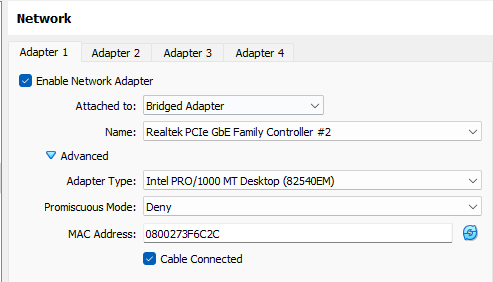

# Setup VirtualBox VM image based on Ubuntu 20.04 LTS ready for Kuburnetes Node

## 1. Setup a baseline of Ubuntu VM using VirutalBox

- Download Ubuntu 20.04 LTS image file (.iso)
- Create a VM with VirutalBox
	- In the Network setting, you have to select "Bridged Adapter" and Adapter Type to
	to your host network adapter. 

<p align="center">
 
</p>

- Install SSH 
	``` Shell
	sudo apt update
	sudo apt install openssh-server
	```
	``` Shell
	sudo systemctl status ssh
	```
  - Ubuntu ships with a firewall configuration tool called UFW. If the firewall is enabled on your system, make sure to open the SSH port:
	``` Shell
	sudo ufw allow ssh
	```
	Check the network IP address and configuration
	``` Shell
	ip a
	```
	You can test the SSH by 
	``` Shell
	ssh user@IP address
	```
- Set up Docker
	- Installation of Docker
	```    
	sudo apt update  
	sudo apt install docker.io -y  
	```
	- Enable Docker
	```
	sudo systemctl enable docker  
	sudo systemctl status docker  
	sudo systemctl start docker  
	```   
- Nodes required to turn off SWAP to run Kubernetes. 
	Run the below commmand
	``` Shell
	sudo swapoff -a
	```
	Comment out the entry of SWAP in /etc/fstab. Use this commands to check the SWAP
	``` Shell
	free -g
	```
	or
	``` Shell
	swapon -s
	```
	
- Prepare the installation of packages for the Kubernetes

	Update the apt package index and install packages needed to use the Kubernetes apt repository, 
	[read the Kubernetes Documentation](https://kubernetes.io/docs/setup/production-environment/tools/kubeadm/install-kubeadm/)
	
	``` Shell
	sudo apt-get updatels 
	sudo apt-get install -y apt-transport-https ca-certificates curl
	```
	Download the Google Cloud public signing key:
	``` Shell
	sudo curl -fsSLo /etc/apt/keyrings/kubernetes-archive-keyring.gpg https://packages.cloud.google.com/apt/doc/apt-key.gpg
	```
	Add the Kubernetes apt repository:
	``` Shell
	echo "deb [signed-by=/etc/apt/keyrings/kubernetes-archive-keyring.gpg] https://apt.kubernetes.io/ kubernetes-xenial main" | sudo tee /etc/apt/sources.list.d/kubernetes.list
	```
	**_Note_**: In releases older than Debian 12 and Ubuntu 22.04, /etc/apt/keyrings does not exist by default. You can create this directory if you need to, making it world-readable but writeable only by admins. 

- Plan the Hostname, IP, and MAC address for each of your nodes. I have define all the nodes information as below

	|Hostname|IP address|MAC address |Type	|Memory	|Disk	|CPUs	|
	|--------|---------------|-------------|-----|-------|-----|-----|
	|kubeM1	 |192.168.11.150 |080027022924 |Master|4G	    |25G	|2		|
	|kubeM2	 |192.168.11.151 |08002772E42B |Master|4G	    |25G	|2		|			
	|kube03	 |192.168.11.152 |080027EA5479 |Worker|4G	    |25G	|2		|					
	|kube04	 |192.168.11.153 |0800270E6FC7|	Worker|4G	    |25G	|2		|						
	|kube05	 |192.168.11.154 |08002778A66A|	Worker|4G	    |25G	|2		|						
	|kube06	 |192.168.11.155 |080027792E53|	Worker|4G	    |25G	|2		|					
	- I use my Wifi router to control the IP for each VM with the defined MAC address
	- Also, I edit the file /etc/hosts with the IP address and hostname pair on the VM baseline

## 2. Installation of Kubernetes steps for each VM Node
- **Setup Hostname and MAC Address**

  The MAC address can be set before the VirtualBox VM started in the network settiong

	<p align="center">
	
	</p>

  Then modify /etc/hostname and /etc/hosts for the hostname


- **Install container runtime**
  - The install and configure prerequisites

	Forwarding IPv4 and letting iptables see bridged traffic as described 
	[Kubernetes documentation.](https://kubernetes.io/docs/setup/production-environment/container-runtimes/)
	``` Shell
	cat <<EOF | sudo tee /etc/modules-load.d/k8s.conf
	overlay
	br_netfilter
	EOF
	```
	``` Shell
	sudo modprobe overlay
	sudo modprobe br_netfilter

	# sysctl params required by setup, params persist across reboots
	cat <<EOF | sudo tee /etc/sysctl.d/k8s.conf
	net.bridge.bridge-nf-call-iptables  = 1
	net.bridge.bridge-nf-call-ip6tables = 1
	net.ipv4.ip_forward                 = 1
	EOF

	# Apply sysctl params without reboot
	sudo sysctl --system
	```
	Verify that the br_netfilter, overlay modules are loaded by running below instructions:
	``` Shell
	lsmod | grep br_netfilter
	lsmod | grep overlay
	```
	Verify that the net.bridge.bridge-nf-call-iptables, net.bridge.bridge-nf-call-ip6tables, net.ipv4.ip_forward system variables are set to 1 in your sysctl config by running below instruction:
	```
	sysctl net.bridge.bridge-nf-call-iptables net.bridge.bridge-nf-call-ip6tables net.ipv4.ip_forward
	```

  - Docker is used as the container runtime for Kubernetes. Please follow the installation procedure of 
	cri-dockerd [here](https://github.com/Mirantis/cri-dockerd). 

- **Install Kubernetes packages**

  - Update apt package index, install kubelet, kubeadm and kubectl
	``` Shell
	sudo apt-get update
	sudo apt-get install -y kubelet kubeadm kubectl kubernetes-cni
	```

  - Then run the below command to pin their version:
	``` Shell
	sudo apt-mark hold kubelet kubeadm kubectl
	```

- **Initializing your control-plane node**
	
	``` Shell
	sudo kubeadm init
	```
	As I run the command first time, I got the below message:

	``` Shell
	Found multiple CRI endpoints on the host. Please define which one do you wish to use by setting the 'criSocket' field in the kubeadm configuration file: unix:///var/run/containerd/containerd.sock, unix:///var/run/cri-dockerd.sock
	To see the stack trace of this error execute with --v=5 or higher
	```
	As mentioned in Kubernetes documentation, 
	
	|Runtime	| Path to Unix domain socket |
	|--|--|
	|containerd	|unix:///var/run/containerd/containerd.sock|
	|CRI-O	|unix:///var/run/crio/crio.sock|
	|Docker Engine (using cri-dockerd)	| unix:///var/run/cri-dockerd.sock|

	I have to re-run the command as below:
	``` Shell
	sudo kubeadm init --cri-socket=unix:///var/run/cri-dockerd.sock
	```
	Here is the output from the command:
	``` Shell
	Your Kubernetes control-plane has initialized successfully!
	
	To start using your cluster, you need to run the following as a regular user:
	
	  mkdir -p $HOME/.kube
	  sudo cp -i /etc/kubernetes/admin.conf $HOME/.kube/config
	  sudo chown $(id -u):$(id -g) $HOME/.kube/config
	
	Alternatively, if you are the root user, you can run:
	
	  export KUBECONFIG=/etc/kubernetes/admin.conf
	
	You should now deploy a pod network to the cluster.
	Run "kubectl apply -f [podnetwork].yaml" with one of the options listed at:
	  https://kubernetes.io/docs/concepts/cluster-administration/addons/
	
	Then you can join any number of worker nodes by running the following on each as root:
	
	sudo kubeadm join 192.168.11.150:6443 --token 7oeub1.07jqmcx87vllnq6x \
	        --discovery-token-ca-cert-hash sha256:b0f1466084cc26ea4a9aec4523f0cd93eaafdfd9aa6114408c96de326aa03a21 --cri-socket=unix:///var/run/cri-dockerd.sock
	```
	Follow the instruction from the above output to setup the environment to run the K8 commands as non-root user
	``` Shell
	mkdir -p $HOME/.kube
	sudo cp -i /etc/kubernetes/admin.conf $HOME/.kube/config
	sudo chown $(id -u):$(id -g) $HOME/.kube/config
	```
	You should store the last line of the output of *kubeadm init* for other nodes to join the cluster

- **Install Container Network Interface (CNI) Plugin**
	If you run the kubectl get node, you get this output
	```Shell
	NAME     STATUS      ROLES           AGE   VERSION
	kube03   NotReady    <none>          42h   v1.26.2
	kubem1   NotReady    control-plane   43h   v1.26.2
	```
	I chooice to use **Calico** CNI. You can follow the same steps in [here](https://docs.tigera.io/calico/3.25/getting-started/kubernetes/hardway/install-cni-plugin) to install CNI plugin. 
	If you run the command again, you will get this output
	``` Shell
	$ kubectl get node
	NAME     STATUS   ROLES           AGE   VERSION
	kube03   Ready    <none>          42h   v1.26.2
	kubem1   Ready    control-plane   43h   v1.26.2
	```

- **Join your working node to the cluster**
	You can just use the last line from the output of *kubeadm init* in the control-plane node
	``` Shell
	sudo kubeadm join 192.168.11.150:6443 --token 7oeub1.07jqmcx87vllnq6x \
	        --discovery-token-ca-cert-hash sha256:b0f1466084cc26ea4a9aec4523f0cd93eaafdfd9aa6114408c96de326aa03a21 --cri-socket=unix:///var/run/cri-dockerd.sock
	```
